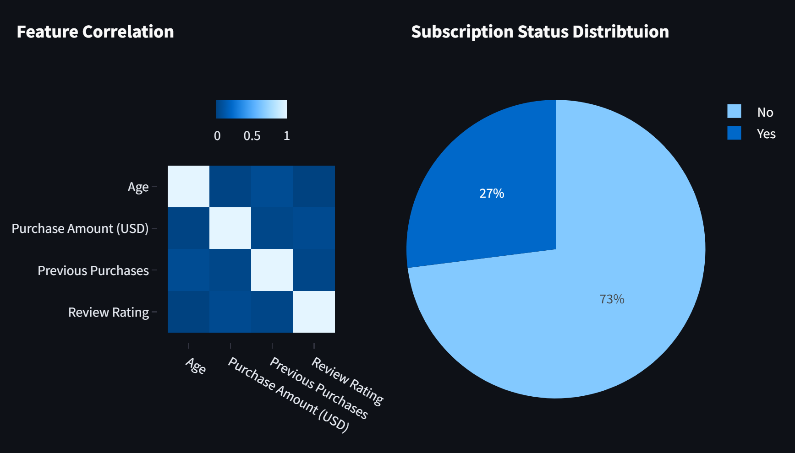

# **Prediction of a Customer Subscription Status**
## **Business Case**
Use case: Predict the review rating of a customer.
Target: `Review Rating`
Nowadays customers decide where to spend their money based on review ratings posted on social media, for example, Google reviews. A bad review rating could translate into financial loses to a business.

Predicting the review rating of a customer could let the clothing company take immediate action to prevent a bad rating or further positive enagagement of the customer. For example, the store staff could offer a discount, cupon, or any other complementary service at the checkout.





## Overview

This is your new Kedro project, which was generated using `kedro 0.18.14`.

Take a look at the [Kedro documentation](https://docs.kedro.org) to get started.

## Rules and guidelines

In order to get the best out of the template:

* Don't remove any lines from the `.gitignore` file we provide
* Make sure your results can be reproduced by following a data engineering convention
* Don't commit data to your repository
* Don't commit any credentials or your local configuration to your repository. Keep all your credentials and local configuration in `conf/local/`

## How to install dependencies

Declare any dependencies in `src/requirements.txt` for `pip` installation and `src/environment.yml` for `conda` installation.

To install them, run:

```
pip install -r src/requirements.txt
```

## How to run your Kedro pipeline

You can run your Kedro project with:

```
kedro run
```

## How to test your Kedro project

Have a look at the file `src/tests/test_run.py` for instructions on how to write your tests. You can run your tests as follows:

```
kedro test
```

To configure the coverage threshold, go to the `.coveragerc` file.

## Project dependencies

To generate or update the dependency requirements for your project:

```
kedro build-reqs
```

This will `pip-compile` the contents of `src/requirements.txt` into a new file `src/requirements.lock`. You can see the output of the resolution by opening `src/requirements.lock`.

After this, if you'd like to update your project requirements, please update `src/requirements.txt` and re-run `kedro build-reqs`.

[Further information about project dependencies](https://docs.kedro.org/en/stable/kedro_project_setup/dependencies.html#project-specific-dependencies)

## How to work with Kedro and notebooks

> Note: Using `kedro jupyter` or `kedro ipython` to run your notebook provides these variables in scope: `context`, `catalog`, and `startup_error`.
>
> Jupyter, JupyterLab, and IPython are already included in the project requirements by default, so once you have run `pip install -r src/requirements.txt` you will not need to take any extra steps before you use them.

### Jupyter
To use Jupyter notebooks in your Kedro project, you need to install Jupyter:

```
pip install jupyter
```

After installing Jupyter, you can start a local notebook server:

```
kedro jupyter notebook
```

### JupyterLab
To use JupyterLab, you need to install it:

```
pip install jupyterlab
```

You can also start JupyterLab:

```
kedro jupyter lab
```

### IPython
And if you want to run an IPython session:

```
kedro ipython
```

### How to convert notebook cells to nodes in a Kedro project
You can move notebook code over into a Kedro project structure using a mixture of [cell tagging](https://jupyter-notebook.readthedocs.io/en/stable/changelog.html#release-5-0-0) and Kedro CLI commands.

By adding the `node` tag to a cell and running the command below, the cell's source code will be copied over to a Python file within `src/<package_name>/nodes/`:

```
kedro jupyter convert <filepath_to_my_notebook>
```
> *Note:* The name of the Python file matches the name of the original notebook.

Alternatively, you may want to transform all your notebooks in one go. Run the following command to convert all notebook files found in the project root directory and under any of its sub-folders:

```
kedro jupyter convert --all
```

### How to ignore notebook output cells in `git`
To automatically strip out all output cell contents before committing to `git`, you can run `kedro activate-nbstripout`. This will add a hook in `.git/config` which will run `nbstripout` before anything is committed to `git`.

> *Note:* Your output cells will be retained locally.

## Package your Kedro project

[Further information about building project documentation and packaging your project](https://docs.kedro.org/en/stable/tutorial/package_a_project.html)

## **Project Highlights**
- Implementation of an ML pipeline using Kedro
- Integration of Kaggle API into a Kedro pipeline
- The project includes the following pipeline items:
    - `eda`
    - `data_acquisition` using Kaggle API.
    - `data_processing`
    - `model_training`
        - baseline using Decision Tree
        - implemented algorithms: 
        ```
        'Decision Tree': DecisionTreeClassifier,
        'XGBoost': XGBClassifier,
        'Logistic Regression': LogisticRegression,
        'KNN': KNeighborsClassifier,
        'Naive Bayes': GaussianNB,
        'SVM': svm
        ```
    - `model_validation`
    
    that can be run separately as:
    ```
    kedro run --pipeline pipeline_item
    ```


- Data exploration using a Streamlit dashboard, which can be invoked through:

    ```
    streamlit run streamlit-entry.py
    ```


Note: `03_primary` and `04_feature` data sets do not necessarily add value to the data science pipeline, however, they are included in the pipeline with the objective of exploring the use of those data layers. Here, the ML pipelines only use the `02_intermediate` dataset.

## Notes about installation
Should you have any problems installing `kedro[pandas]` through `pip install kedro[pandas]` try performing separate type level instalaltions, e.g., 

```
pip install kedro-datasets[pandas.ParquetDataset]
pip install kedro-datasets[matplotlib.MatplotlibWriter]
```

## Kaggle API configuration
Add API Kaggle token to `./conf/local/credentials.yml` as follows:
```
kaggle:
      KAGGLE_USERNAME: my_kaggle_username
      KAGGLE_KEY: my_kaggle_key
```

The `KAGGLE_KEY` refers to your Kaggle token. How to create a Kaggle token is described [here](https://www.kaggle.com/docs/api#getting-started-installation-&-authentication).

