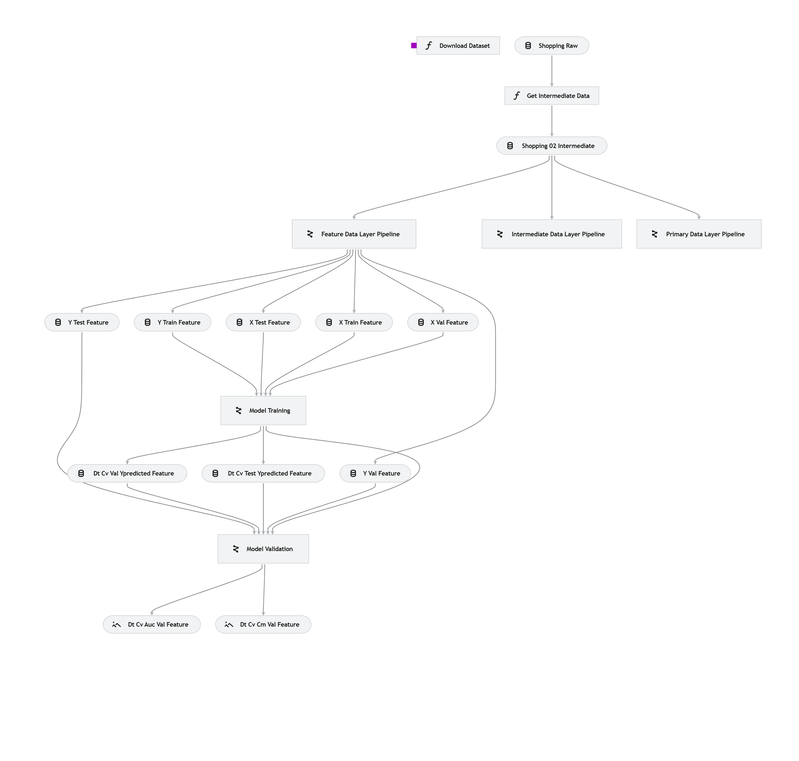
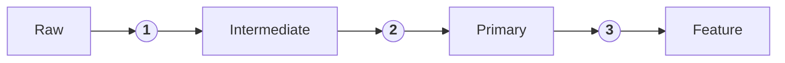
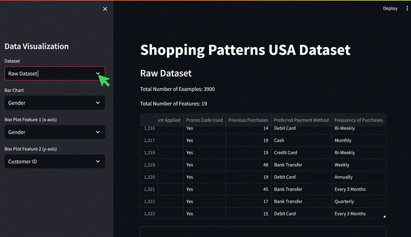

# **Prediction of a Customer Subscription Status**
## **1. Business Case**
Herein, an ML is trained to predict a customer subscription status. By predicting the subscription status of a customer, the company would have the chance to promote customized products to the customer. A targeted advertisement of products could eventually lead to them subscribing to a service.

In this project, I explore the implementation of Kedro, MLflow, and Kaggle to create a streamlined ML framework. The pipeline consumes a Kaggle dataset via the Kaggle API service. Later, the acquired data is processed and used to train an ML model using Kedro's scheme. Finally, the generated models and the artifacts are tracked and versioned using MLflow. Figure 1 includes a visualization of a subsection of the Kedro pipeline.

<figure>
  
  <figcaption>Figure 1. Kedro feature data layer pipeline.</figcaption>
</figure>

## **2. Data Acquisition**
The dataset used here was obtained from Kaggle and can be found with the following information:

```
Dataset name: customer-shopping-trends-dataset
File name: shopping_trends.csv
Kaggler user name: iamsouravbanerjee
```

The data is available as a tabular dataset in the `.csv` format. The last time the dataset was accessed was on September 7th, 2024. More information about how to configure the pipeline to get the data using the Kaggle API app is discussed in the [Kaggle API configuration](#6.4) section

## **3. Data Processing**
The data, originally containing 3900 examples and 19 features was processed in three different ways by adopting feature engineering. As a result, four different data layers were obtained, `raw`, `intermediate`, `primary`, and `feature`. The data layer `raw` is the  `intermediate`, `primary`, and `feature` were The purpose of creating three data layers is to compare the impact of feature engineering and feature selection on the model performance. 




|Step| Transformations|
|:---:|:---:|
|`1`| Fix redundant purchase frequency, encode target|
|`2`| `1`, encode `review rating` into ranges, `location` (states) into regions, `color`s into general hues, `item purchased` into categories|
|`3`| `1`, `2`, encode `age`, `purchase amount`, and `previous purchase` into groups|


## **4. Model Training**
- **Target**: `Subscription Status`
- **ML Problem**: Bimodal classification
- **Training/Validation/Test dataset size**:
    - training: 0.8
    - test: 0.15
    - validation: 0.05
  
## **5. Model Performance**
- Implementation of an ML pipeline using Kedro
- Integration of Kaggle API into a Kedro pipeline
- The project includes the following pipeline items:
    - `eda`
    - `data_acquisition` using Kaggle API.
    - `data_processing`:
        - This steps explores the creatio of three different data layers called `intermediate`, `primary`, and `feature`.
    - `model_training`
        - baseline using Decision Tree
        - implemented algorithms: 
        ```
        'Decision Tree': DecisionTreeClassifier,
        'XGBoost': XGBClassifier,
        'Logistic Regression': LogisticRegression,
        'KNN': KNeighborsClassifier,
        'Naive Bayes': GaussianNB,
        'SVM': svm
        ```
    - `model_validation`

## **6. How-To**
### **6.1 Model Training Configuration**
```
model_training:
  classifier: Decision Tree
  dataset_stage: primary
  kfold: True
  hyperparams:
    criterion: ['gini', 'entropy', 'log_loss']
    splitter: ['best', 'random']
    max_depth: [2, 4, 8]
```

### **6.2 Running the Pipeline**
- The entire pipeline can be run using the following command

```
kedro run
```

- The artifacts, including metrics, per each run are tracked using mlflow. To specify the name of the run, for example, when a specific data layer is consumed:

```
kedro run --params mlflow_run_name="my-awesome-name"
```
    
- Alternativetely, each pipeline can be run separately as:

```
kedro run --pipeline pipeline_item
```

where `pipeline_item` can be `data_acquisition`, `data_processing`, `eda`, `model_training`, `model_validation`

- Finally, a Streamlit dashboard is implemented to explore the data interactivelly. The dashboard is invoked through:

```
streamlit run streamlit-entry.py
```

<figure>
  
  <figcaption>Figure 2. Subscription Status Distribution.</figcaption>
</figure>


> [!NOTE] 
> The `03_primary` and `04_feature` data sets do not necessarily add value to the data science pipeline, however, they are included in the pipeline with the objective of exploring the use of those data layers. Here, the ML pipelines only use the `02_intermediate` dataset.

- MLflow for `model tracking`
    ```
    mlflow ui --backend-store-uri ./mlflow_runs
    ```
    > [!NOTE]
    > The `./mlflow_runs` directory is created upon `kedro run` execution.

## **6.3 Notes about installation**
Should you have any problems installing `kedro[pandas]` through `pip install kedro[pandas]` try performing separate type level instalaltions, e.g., 

```
pip install kedro-datasets[pandas.ParquetDataset]
pip install kedro-datasets[matplotlib.MatplotlibWriter]
```

> [!IMPORTANT]  
> Partial migration from Kedro 0.18.14 to 0.19.8 was done, meaning that some capabilities might need further update.

## **6.4 Kaggle API configuration**<a id='3.4'></a>
Add API Kaggle token to `./conf/local/credentials.yml` as follows:
```
kaggle:
      KAGGLE_USERNAME: my_kaggle_username
      KAGGLE_KEY: my_kaggle_key
```

The `KAGGLE_KEY` refers to your Kaggle token. How to create a Kaggle token is described [here](https://www.kaggle.com/docs/api#getting-started-installation-&-authentication).

## **6.5 MLflow UI**
```
mlflow ui --backend-store-uri ./mlflow_runs
```
> [!NOTE]
> The `./mlflow_runs` directory is created upon `kedro run` execution.
