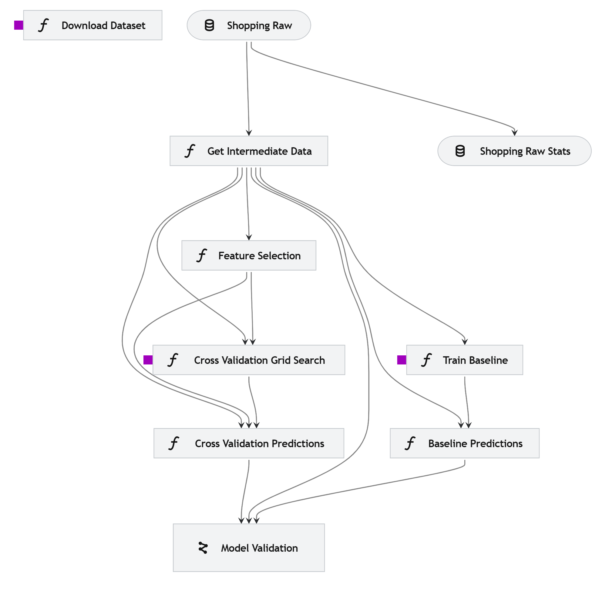
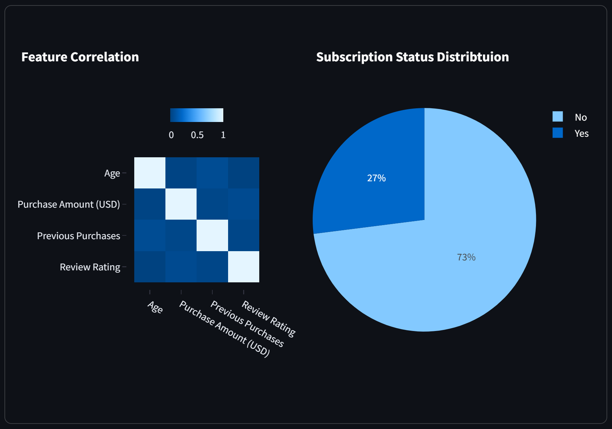

# **Prediction of a Customer Subscription Status**
## **Business Case**
Use case: Predict the customer subscription status.
Target: `Subscription Status`

## **Project Highlights**
- Implementation of an ML pipeline using Kedro
- Integration of Kaggle API into a Kedro pipeline
- The project includes the following pipeline items:
    - `eda`
    - `data_acquisition` using Kaggle API.
    - `data_processing`
    - `model_training`
        - baseline using Decision Tree
        - implemented algorithms: 
        ```
        'Decision Tree': DecisionTreeClassifier,
        'XGBoost': XGBClassifier,
        'Logistic Regression': LogisticRegression,
        'KNN': KNeighborsClassifier,
        'Naive Bayes': GaussianNB,
        'SVM': svm
        ```
    - `model_validation`
    
    that can be run separately as:
    ```
    kedro run --pipeline pipeline_item
    ```


- Data exploration using a Streamlit dashboard, which can be invoked through:

    ```
    streamlit run streamlit-entry.py
    ```



Note: `03_primary` and `04_feature` data sets do not necessarily add value to the data science pipeline, however, they are included in the pipeline with the objective of exploring the use of those data layers. Here, the ML pipelines only use the `02_intermediate` dataset.

## Notes about installation
Should you have any problems installing `kedro[pandas]` through `pip install kedro[pandas]` try performing separate type level instalaltions, e.g., 

```
pip install kedro-datasets[pandas.ParquetDataset]
pip install kedro-datasets[matplotlib.MatplotlibWriter]
```

## Kaggle API configuration
Add API Kaggle token to `./conf/local/credentials.yml` as follows:
```
kaggle:
      KAGGLE_USERNAME: my_kaggle_username
      KAGGLE_KEY: my_kaggle_key
```

The `KAGGLE_KEY` refers to your Kaggle token. How to create a Kaggle token is described [here](https://www.kaggle.com/docs/api#getting-started-installation-&-authentication).

