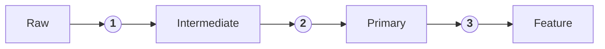

# **Prediction of a Customer Subscription Status**
## **1. Business Case**<a id='1'></a>
Herein, an ML is trained to predict a customer subscription status. By predicting the subscription status of a customer, the company would have the chance to promote customized products to the customer. A targeted advertisement of products could eventually lead to them subscribing to a service.

In this project, I explore the implementation of Kedro, MLflow, and Kaggle to create a streamlined ML framework. The pipeline consumes a Kaggle dataset via the Kaggle API service. Later, the acquired data is processed and used to train an ML model using Kedro's scheme. Finally, the generated models and the artifacts are tracked and versioned using MLflow. Figure 1 includes a visualization of a subsection of the Kedro pipeline.

<figure>
  <p align="center">
  
  <figcaption>Figure 1. Kedro feature data layer pipeline.</figcaption>
  </p>
</figure>

## **2. Quick Start**<a id='2'></a>
To run the pipeline use the following command

```bash
kedro run --params mlflow_run_name="my-run-name" --pipeline "pipeline_item"
```

where `pipeline_item` can be `data_acquisition`, `data_processing`, `eda`, `model_training`, `model_validation`
- The artifacts, including metrics, per each run are tracked using mlflow. To specify the name of the run, for example, when a specific data layer is consumed:


## **3. Data Acquisition**<a id='3'></a>
The dataset used here was obtained from Kaggle and can be found with the following information:

```
Dataset name: customer-shopping-trends-dataset
File name: shopping_trends.csv
Kaggler user name: iamsouravbanerjee
```

The data is available as a tabular dataset in the `.csv` format. It was last accessed on September 7th, 2024. Add the corresponding API Kaggle token to [credentials.yml](./conf/local/) as follows:

```yaml
kaggle:
      KAGGLE_USERNAME: my_kaggle_username
      KAGGLE_KEY: my_kaggle_key
```

Where the `KAGGLE_KEY` refers to your Kaggle token. Information on how to create a Kaggle token is described [here](https://www.kaggle.com/docs/api#getting-started-installation-&-authentication).

> [!NOTE]
> The source data is a synthetic dataset that might not possess the statistical nature of a real scenario. This is important to consider when analyzing the model performance.

## **4. Data Processing**<a id='4'></a>
The data, originally containing 3900 examples and 19 features was processed in three different ways by adopting feature engineering. As a result, four different data layers were obtained, `raw`, `intermediate`, `primary`, and `feature`. The data layer `raw` is an intact copy of the Kaggle dataset. While the `intermediate`, `primary`, and `feature` are transformed versions of the `raw` dataset and were used to train a model. The purpose of creating three data layers is to compare the impact of feature engineering and feature selection on the model performance. In addition, different data layers were created to test the use of the Kedro data layers infrastructure.



|Step| Transformations|
|:---:|:---:|
|`1`| Fix redundant `purchase frequency`, encode target `subscription status`|
|`2`| `1`, encode `review rating` into ranges, `location` (states) into regions, `color`s into general hues, `item purchased` into categories|
|`3`| `1`, `2`, encode `age`, `purchase amount`, and `previous purchase` into groups|

A Streamlit dashboard, [Figure 2](#figure2), is implemented to explore each data layer. The dashboard can be invoked through `streamlit run streamlit-entry.py`.

<figure id="figure2">
  <p align="center">
  
  <figcaption>Figure 2. Streamlit dashboard overview.</figcaption>
  </p> 
</figure>


## **5. Model Training**<a id='5'></a>
The model training step is performed by assuming the following configuration presets:
- **Target**: `Subscription Status`
- **ML Problem**: Bimodal classification
- **Training/Validation/Test dataset size**:
    - training: 0.8
    - test: 0.15
    - validation: 0.05

The pipeline supports different `sklearn` methods. The name code to access each method is given below in the format `'name code': method`.

```yaml
'XGBoost': XGBClassifier
'Logistic Regression': LogisticRegression
'KNN': KNeighborsClassifier
'Naive Bayes': GaussianNB
'SVM': svm
```

The `model_training` pipeline is configured to execute a baseline run and a feature selection, which is performed using the `mutual_info_classif` sklearn module, followed by a parameter grid search for hyperparameter tunning. The parameters to be explored in the grid search should be provided in the corresponding parameters file, i.e., [parameters_model_training](conf/base/parameters_model_training.yml), as follows:

```yaml
model_training:
  classifier: Decision Tree
  data_layer: intermediate # intermediate, primary, or feature
  kfold: True
  top_n_features: 10
  hyperparams:
    criterion: ['gini', 'entropy', 'log_loss']
    splitter: ['best', 'random']
    max_depth: [2, 4, 8, 16]
```

Here, the `classifier` (or method) can be any of the methods supported by the pipeline mentioned before. The `data_layer` can be any of the data layers mentioned before, i.e., `intermediate`, `primary` or `feature`. The `top_n_features` refers to the `n` features with the highest importance according to the `mutual_info_classif` method. More on the impact of the feature selection is discussed in the [Model Performance](#5.) section. Finally, `hyperparams` are the parameters scanned during the grid search.

> [!WARNING]
> Make sure that the method (alias classifier) in the `model_training` pipeline parameters file matches that in the `model_validation` one.
> Otherwise, the training and validation will be done on different methods.

All the datasets from the three different layers are split into a training, validation, and test dataset. The validation test is used to compare the models based on their performance. Whereas, the test dataset is used to evaluate the model performance in production. The metrics used to analyze the model performance are discussed in the next section. 

The datasets and model artifacts including the trained model(s) and their corresponding artifacts are monitored with mlflow. An overview of the MLflow dashboard is shown in [Figure 3](#fig3)

<figure id="figure3">
  <p align="center">
  
  <figcaption>Figure 3. MLflow dashboard.</figcaption>
  </p> 
</figure>


The MLflow dashboard can be run using the following command

```bash
mlflow ui --backend-store-uri ./mlflow_runs
```


## **6. Model Performance**<a id='6'></a>
The performance of the trained models is evaluated by the `model_validation` pipeline using metrics appropriate for the classification task such as `f1 score`, `recall, and `accuracy`. In addition, a confusion matrix and an AUC-ROc curve are plotted in each case. All the artifacts obtained from the `model_validation` pipeline are also tracked by mlflow.

Each time the model_validation pipeline, the corresponding parameters file should be modified accordingly. Unless otherwise is explicitly required, it is recommended to match the `classifier` and `data_layer` in model_training and model_validation

```yaml
model_validation:
  classifier: Decision Tree
  data_layer: primary
```

The feature selection suggested that beyond features `Promo Code Used`, `Discount Applied`, and `Gender`, the rest would not impact the model performance. This observation was later verified in the. 


## **7. Notes about installation**<a id='7'></a>
Should you have any problems installing `kedro[pandas]` through `pip install kedro[pandas]` try performing separate type level instalaltions, e.g., 

```
pip install kedro-datasets[pandas.ParquetDataset]
pip install kedro-datasets[matplotlib.MatplotlibWriter]
```

> [!IMPORTANT]  
> Partial migration from Kedro 0.18.14 to 0.19.8 was done, meaning that some capabilities might need further update.


## **8. Future Work**<a id='8'></a>
- [ ] Serve the model via the streamlit dashboard and furthermore, deploy the streamlit dashboard. 
- [ ] Tests. For example, to validate the ingested data and the input parameters.
